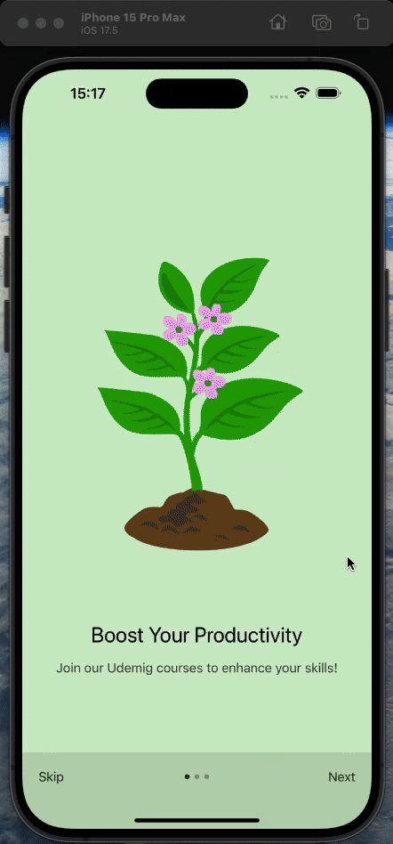

# ToDo App Async Storage - React Native

In this ToDo list app developed using React Native, users can add new tasks to the task list, edit them, and delete them with persistent storage (using Async Storage) to prevent data loss. It also provides an animated (using Lottie) onboarding screen to the user.

## Technologies Used

- React Native Async Storage
- React Navigation - Native Stack
- Lottie React Native
- Iconsax React Native
- React Native Onboarding Swiper
- React Native Linear Gradient

## Project GIF

# React-Native-ToDo-App-Async-Storage
